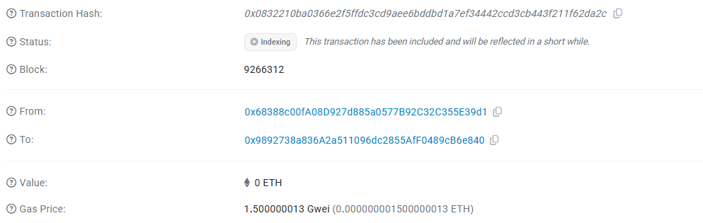

# Private AI Training

A revolutionary decentralized platform for confidential machine learning using Fully Homomorphic Encryption (FHE) smart contracts.

## 🔐 Core Concepts

### Privacy-First Artificial Intelligence
Private AI Training leverages cutting-edge Fully Homomorphic Encryption technology to enable machine learning on encrypted data. This groundbreaking approach ensures that sensitive training data remains private throughout the entire learning process while still allowing for collaborative model development.

### Confidential Machine Learning
Our platform implements a novel approach to AI training where:
- **Data Privacy**: All training data is encrypted at the source and remains encrypted throughout the computation
- **Model Confidentiality**: Neural network weights and biases are protected using FHE encryption
- **Secure Aggregation**: Multiple participants can contribute data without revealing individual inputs
- **Verifiable Training**: Blockchain technology ensures transparent and auditable AI model development

### Decentralized Training Network
The system creates a trustless environment where:
- Multiple parties can collaborate on AI model training without exposing their private data
- Contributors are rewarded for providing quality training data
- Model accuracy and training progress are transparently tracked on-chain
- Authorization mechanisms ensure only approved trainers can create and manage models

## 🚀 Key Features

- **Encrypted Neural Networks**: Complete model training using Fully Homomorphic Encryption
- **Privacy-Preserving Data Contribution**: Submit training data that remains encrypted end-to-end
- **Decentralized Reward System**: Earn rewards for contributing valuable training data
- **Transparent Model Management**: Track model accuracy, training rounds, and performance metrics
- **Authorization Controls**: Secure trainer approval and access management
- **Real-time Training Sessions**: Live monitoring of collaborative training progress

## 🏗️ Architecture

The platform consists of three main components:

1. **FHE Smart Contract**: Core blockchain contract handling encrypted computations
2. **Training Orchestrator**: Manages training sessions and data aggregation
3. **Privacy Interface**: User-friendly web application for secure interaction

## 📊 Contract Information

**Smart Contract Address**: `0x9892738a836A2a511096dc2855AfF0489cB6e840`

**Network**: Sepolia Testnet (Zama FHE-enabled)

**Key Functions**:
- `createModel()` - Initialize new encrypted AI models
- `startTrainingSession()` - Begin collaborative training rounds
- `contributeTrainingData()` - Submit encrypted training samples
- `performTrainingStep()` - Execute FHE-based gradient descent
- `completeTraining()` - Finalize model and distribute rewards

## 🎥 Demo Video

Watch our comprehensive demonstration showcasing the complete workflow from model creation to training completion:

*The video demonstrates the entire process of creating encrypted AI models, contributing private training data, and completing collaborative training sessions.*

## 📸 Live Interface Screenshots

### Main Dashboard

*The authorization management interface showing trainer approval controls and network statistics.*

### Training Progress

*Real-time view of active training sessions with encrypted data contributions and model performance metrics.*

## 🔗 Links

- **Live Application**: [https://private-ai-training.vercel.app/](https://private-ai-training.vercel.app/)
- **Source Code**: [https://github.com/ClotildeGutkowski/PrivateAITraining](https://github.com/ClotildeGutkowski/PrivateAITraining)

## 🛡️ Security & Privacy

- **End-to-End Encryption**: All sensitive data encrypted using FHE before blockchain submission
- **Zero-Knowledge Training**: Models learn patterns without accessing raw training data
- **Cryptographic Verification**: All training steps verified using advanced cryptographic proofs
- **Decentralized Trust**: No central authority can access private training data

## 🌟 Use Cases

- **Healthcare AI**: Train medical diagnosis models without exposing patient data
- **Financial Services**: Develop fraud detection systems while protecting transaction privacy
- **IoT Analytics**: Aggregate sensor data for predictive models without compromising device privacy
- **Research Collaboration**: Enable multi-institutional AI research with privacy guarantees

## 🤝 Contributing

The platform welcomes contributions from researchers, developers, and data scientists interested in advancing privacy-preserving machine learning. Join our community to help build the future of confidential AI.

---

*Empowering the next generation of privacy-preserving artificial intelligence through blockchain technology and advanced cryptography.*